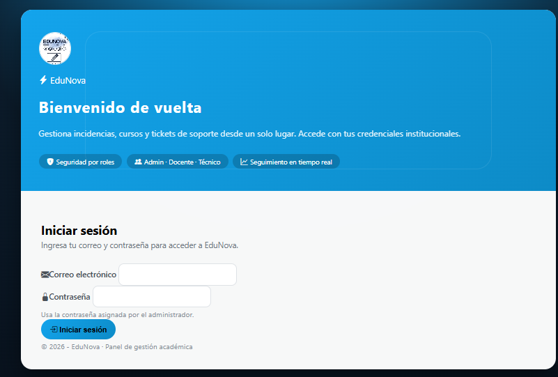
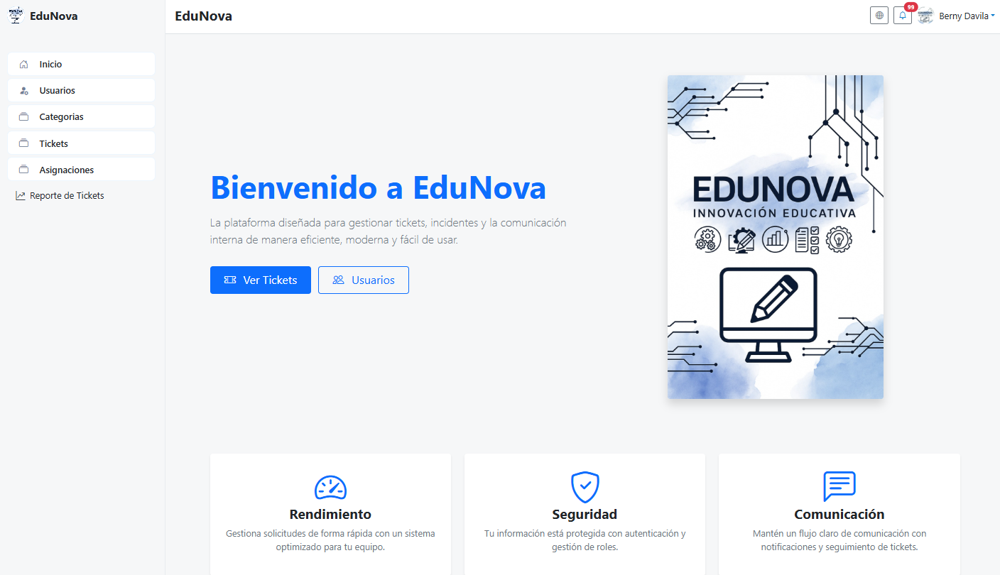
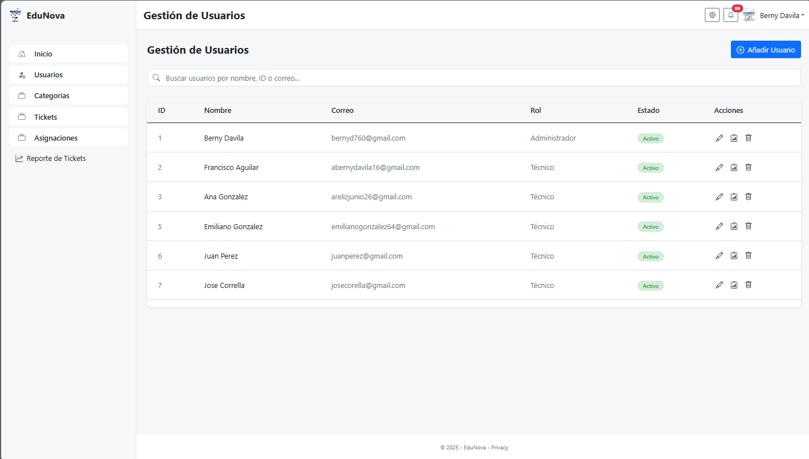
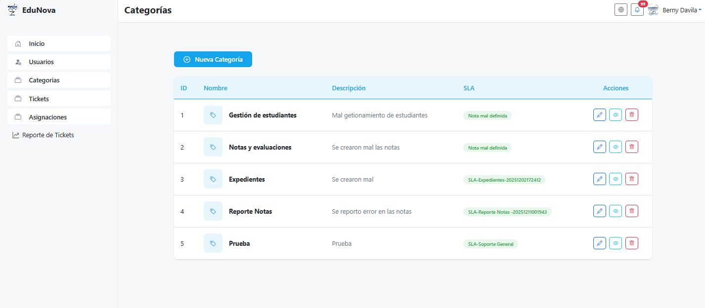
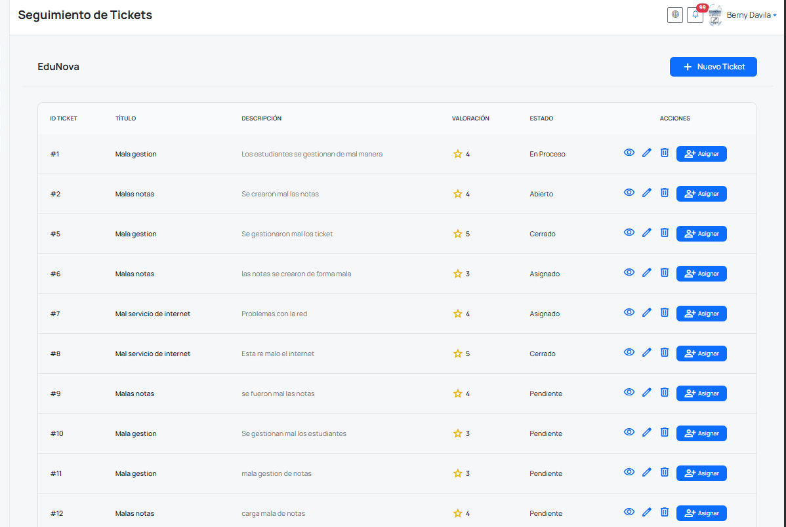
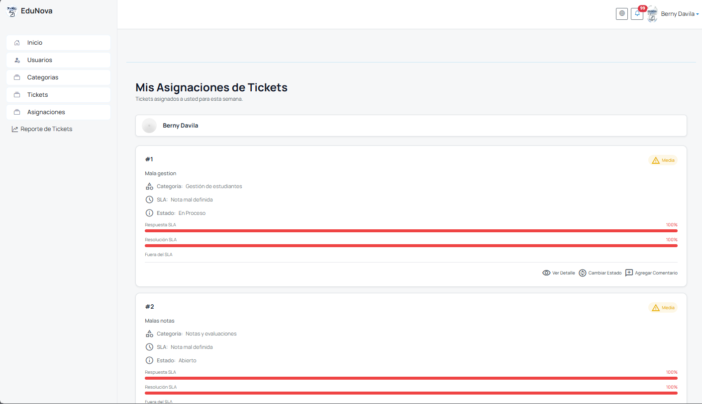
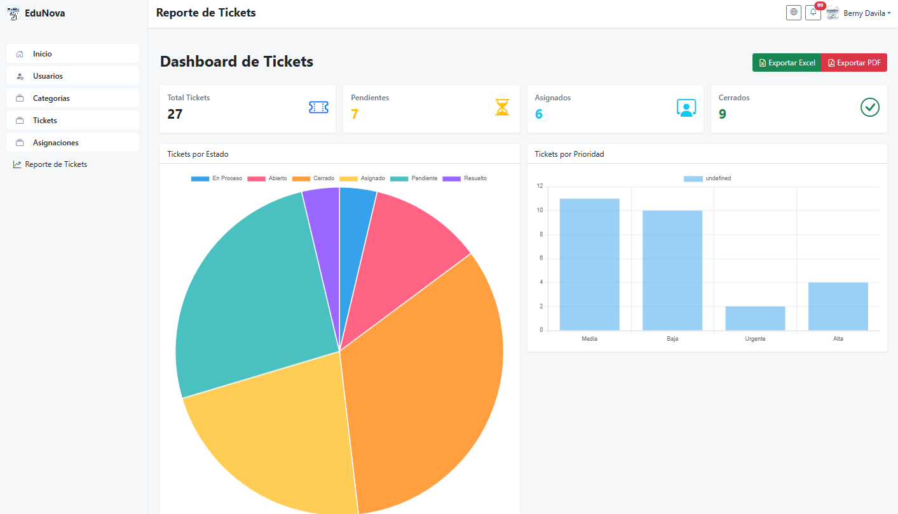
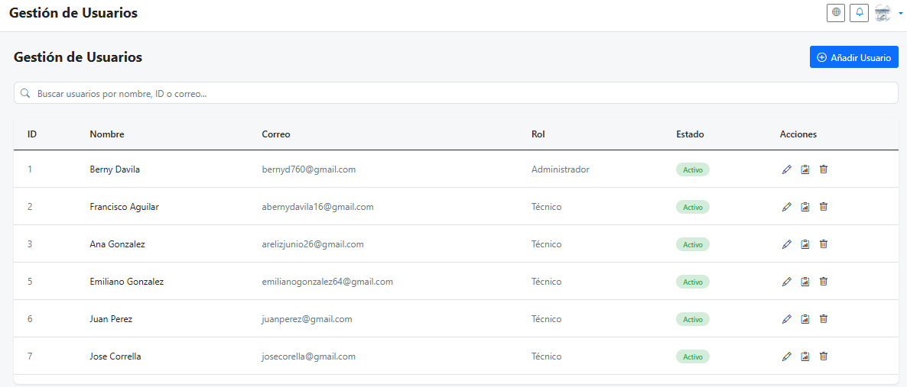
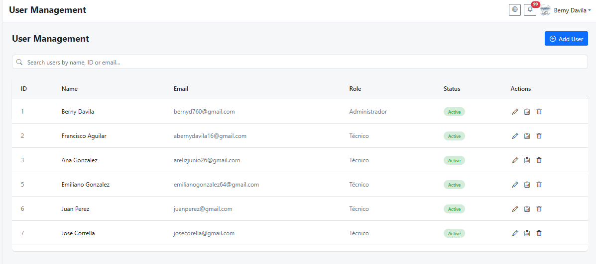

<div align="center">


# 🎓 EduNova

### Plataforma Web para la Gestión Académica y Administración de Incidencias

Sistema desarrollado con ASP.NET Core para optimizar la gestión de tickets, incidencias y procesos administrativos dentro de instituciones educativas.

<br>


</div>

---

#  Descripción

EduNova es una plataforma web desarrollada como proyecto académico para optimizar la administración y seguimiento de incidencias dentro de instituciones educativas.

La aplicación permite administrar usuarios, categorías, tickets, asignaciones y reportes mediante una interfaz moderna, intuitiva y responsive. Además, incorpora autenticación por roles, seguimiento mediante SLA, internacionalización y herramientas para el análisis de información.

---

#  Funcionalidades

-  Inicio de sesión seguro.
-  Gestión completa de usuarios.
-  Administración de categorías.
-  Registro y seguimiento de tickets.
-  Asignación de tickets.
-  Dashboard con estadísticas.
-  Exportación de reportes en PDF.
-  Exportación de reportes en Excel.
-  Cambio dinámico entre Español e Inglés.
-  Gestión de roles.
-  Valoración de tickets.
-  Seguimiento mediante SLA.

---

#  Tecnologías utilizadas

| Backend | Frontend | Base de Datos | Herramientas |
|----------|----------|---------------|--------------|
| ASP.NET Core 8 | HTML5 | SQL Server | Visual Studio |
| C# | CSS3 | Entity Framework Core | Git |
| AutoMapper | Bootstrap | LINQ | Serilog |
| Razor Views | JavaScript | SQL | Newtonsoft.Json |

---

#  Arquitectura

```text
                  Usuario
                     │
                     ▼
              EduNova.Web
                     │
                     ▼
         EduNova.Application
                     │
                     ▼
      EduNova.Infrastructure
                     │
                     ▼
                SQL Server
```

---

#  Vista previa del sistema

##  Inicio de sesión

<p align="center">

</p>

---

##  Dashboard principal

<p align="center">

</p>

---

##  Gestión de Usuarios

<p align="center">

</p>

---

##  Gestión de Categorías

<p align="center">

</p>

---

##  Gestión de Tickets

<p align="center">

</p>

---

##  Asignación de Tickets

<p align="center">

</p>

---

##  Dashboard de Reportes

<p align="center">

</p>

---

#  Internacionalización

EduNova incorpora soporte para múltiples idiomas, permitiendo cambiar dinámicamente entre Español e Inglés para ofrecer una mejor experiencia de usuario.

| Español | English |
|---------|---------|
|  |  |

---

#  Mi participación

Participé activamente como desarrollador **Full Stack** durante el desarrollo del proyecto.

Entre mis principales responsabilidades se encuentran:

- Desarrollo de interfaces de usuario.
- Desarrollo de funcionalidades Backend.
- Integración entre Frontend y Backend.
- Implementación del sistema de internacionalización (Español / Inglés).
- Desarrollo de módulos administrativos.
- Optimización de procesos.
- Corrección de errores.
- Participación en pruebas funcionales y validaciones.

---

# 📂 Estructura del proyecto

```text
EduNova
│
├── EduNova.Web
├── EduNova.Application
├── EduNova.Infrastructure
├── assets
└── README.md
```

---

#  Instalación

```bash
git clone https://github.com/TU-USUARIO/EduNova.git

cd EduNova

dotnet restore

dotnet build

dotnet run
```

---

#  Estado del proyecto

🟢 **Proyecto finalizado**

Desarrollado como parte de la carrera de Ingeniería de Software.

---

#  Autores

- Berny Dávila
- Jeeyson Martínez 

---

#  Licencia

Proyecto desarrollado con fines académicos.
